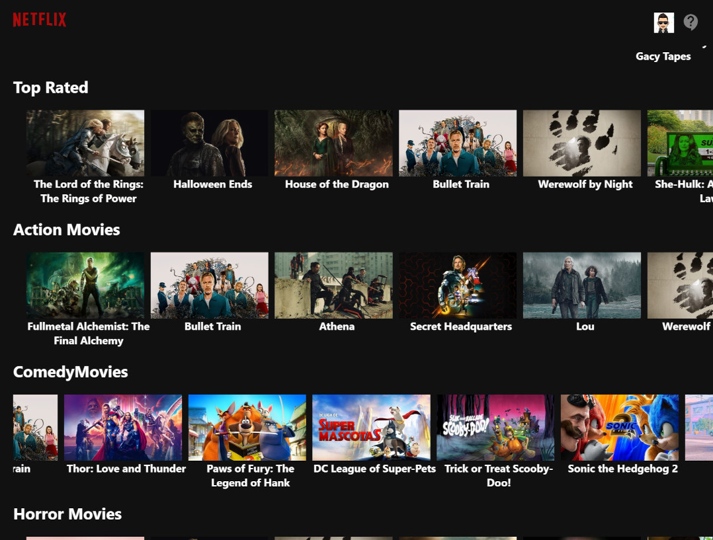

# Netflix-React Movies & Series DB

Netflix-like portal. The movie posters, thumbnails and descriptions are dynamically retrieved from TMDB through its [API](https://www.themoviedb.org/documentation/api) and react-axios component. The movies are classified by different categories. There is also the option to watch the corresponding YouTube trailers when clicking on a thumbnail the app gets the movie name which is passed to the [movie-trailer](https://www.npmjs.com/package/movie-trailer) API to look for the corresponding YouTube movie ID which if found will be passed to the [react-youtube](https://www.npmjs.com/package/react-youtube) component to play it in a modal.

See it in action at: https://movies-db2.web.app/

To sign in you can register with your email or use the following test credentials: Email: test@gmail.com Password: test123 to sig in.

## Screenshots:

  

## Technologies

This project was bootstrapped with [Create React App](https://github.com/facebook/create-react-app), using the [Redux](https://redux.js.org/) and [Redux Toolkit](https://redux-toolkit.js.org/) template as well as the following components, services & dependencies:
- [Material UI V4](https://v4.mui.com/).
- [Material UI Icons](https://v4.mui.com/components/material-icons/#material-icons).
- [TMDB API](https://www.themoviedb.org/documentation/api)
- [Axios](https://github.com/axios/axios) for making http requests to the TMDB API.
- [movie-trailer](https://www.npmjs.com/package/movie-trailer) to obtain YouTube movie IDs from a given movie name.
- [react-youtube](https://www.npmjs.com/package/react-youtube) component to play YouTube videos.
- [Firebase](https://firebase.google.com/) for hosting and  authentication.

## Disclaimer

This application was developed with the purpose of making a UI similar to Netflix by implementing ReactJs components, Redux, Firebase, as well as other react hooks and components. The movie posters, thumbnails, and descriptions are dynamically retrieved from TMDB through its API and react-axios component. 

## Available Scripts

In the project directory, you can run:

### `npm start`

Runs the app in the development mode. 
Open [http://localhost:3000](http://localhost:3000) to view it in the browser.

The page will reload if you make edits. 
You will also see any lint errors in the console.

### `npm test`

Launches the test runner in the interactive watch mode. 
See the section about [running tests](https://facebook.github.io/create-react-app/docs/running-tests) for more information.

### `npm run build`

Builds the app for production to the `build` folder. 
It correctly bundles React in production mode and optimizes the build for the best performance.

The build is minified and the filenames include the hashes. 
Your app is ready to be deployed!

See the section about [deployment](https://facebook.github.io/create-react-app/docs/deployment) for more information.

### `npm run eject`

**Note: this is a one-way operation. Once you `eject`, you can’t go back!**

If you aren’t satisfied with the build tool and configuration choices, you can `eject` at any time. This command will remove the single build dependency from your project.

Instead, it will copy all the configuration files and the transitive dependencies (Webpack, Babel, ESLint, etc) right into your project so you have full control over them. All of the commands except `eject` will still work, but they will point to the copied scripts so you can tweak them. At this point you’re on your own.

You don’t have to ever use `eject`. The curated feature set is suitable for small and middle deployments, and you shouldn’t feel obligated to use this feature. However we understand that this tool wouldn’t be useful if you couldn’t customize it when you are ready for it.

## Learn More

You can learn more in the [Create React App documentation](https://facebook.github.io/create-react-app/docs/getting-started).

To learn React, check out the [React documentation](https://reactjs.org/).
